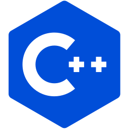

<h1 align="left" id="tremblonx1-title">:wave: Hey Everyone! I'm Rionna Bamania</h1>
<h3 align="left">I am a SWE, learning new toolsets and building exciting projects </h3>

  
  
  
   
  
<h2 align="left">👨🏻‍💻 About Me:</h2>

- :computer: SWE, always looking out for synergetic tech stacks
- :hourglass_flowing_sand: Taking my time to figure out GPU concepts
- :man_technologist: Looking for more open source development tips
- 📖: Writing a fictional novel in my spare time

  
<h2 align="left" id="tremblonx1-tech">Favorite Tech</h2>

> Tools, languages, and other things that I like to work with.

<table>
  <tr>
    <td align="center" width="96">
      
       Python
    </td>
    <td align="center" width="96">
      
       TypeScript
    </td>
    <td align="center" width="96">
      
       JavaScript
    </td>
    <td align="center" width="96">
      
       React
    </td>
    <td align="center" width="96">
      
       Swift/Metal
  </tr>
  <tr>
    <td align="center" width="96">
      
       VSCode
     <td align="center" width="96">
      
       C++
    
  </tr>
</table>
